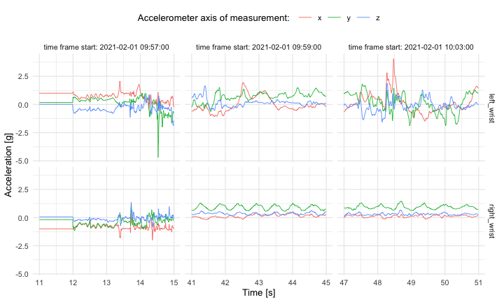
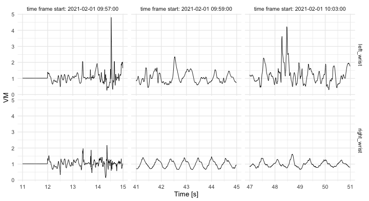
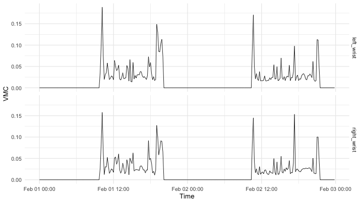

Automatic walking strides segmentation from wrist-worn sensor
accelerometry data collected in the free-living
================

  - [Accelerometry data sample](#accelerometry-data-sample)
      - [Description](#description)
      - [Data visualization](#data-visualization)
  - [Session info](#session-info)

<!-- README.md is generated from README.Rmd. Please edit that file -->

Below, we demonstrate our method for automatic walking strides
segmentation from wrist-worn sensor accelerometry data collected in the
free-living environment.

This repository accompanies “*Estimation of free-living walking cadence
from wrist-worn sensor accelerometry data and its association with SF-36
quality of life scores*” manuscript in which the method is proposed. The
method is implemented as the `segmentWalking()` function in `adept` R
package ([CRAN
index](https://cran.r-project.org/web/packages/adept/index.html)).
Below, we demonstrate the method with the use of independent data sample
(not used in the manuscript study).

### Accelerometry data sample

#### Description

The directory `data/` contains data files:

  - `acc_raw_left_wrist.rds`
  - `acc_raw_right_wrist.rds`

which are a sample of raw accelerometry data collected consecutively for
2 days, starting and ending at midnight of a week day. Data were
collected at the sampling frequency of 100 Hz with two ActiGraph GT9X
Link sensors located at the left wrist and right wrist, respectively.
One data observation includes `(x,y,z)` values collected from each of
the three axes at the same time. At the sampling frequency of 100 Hz,
there were 100 observations collected per second (17,280,000
observations per 2 days) for each of the two sensors.

Below, we read the data and plot a few first and last observations from
left wrist data set.

``` r
library(tidyverse)
library(lubridate)

# read raw accelerometry data from left wrist, right wrist
dat_lw <- readRDS(paste0(here::here(), "/data/acc_raw_left_wrist.rds")) %>% as_tibble()
dat_rw <- readRDS(paste0(here::here(), "/data/acc_raw_right_wrist.rds")) %>% as_tibble()

# define data collection POSIXct (used *fake* day date of Feb 1, 2021)
obs_datetime_seq <- seq(ymd_hms("2021-02-01 00:00:00"), by = 0.01, length.out = nrow(dat_lw))
dat_lw <- mutate(dat_lw, obs_datetime = obs_datetime_seq, .before = "x")
dat_rw <- mutate(dat_rw, obs_datetime = obs_datetime_seq, .before = "x")
```

``` r
rbind(head(dat_lw, 3), tail(dat_lw, 3))
#> # A tibble: 6 x 6
#>   loc_id      obs_idx obs_datetime             x      y      z
#>   <chr>         <int> <dttm>               <dbl>  <dbl>  <dbl>
#> 1 left_wrist        1 2021-02-01 00:00:00  1      0.176  0.016
#> 2 left_wrist        2 2021-02-01 00:00:00  1      0.176  0.016
#> 3 left_wrist        3 2021-02-01 00:00:00  1      0.176  0.016
#> 4 left_wrist 17279998 2021-02-02 23:59:59 -0.977 -0.078 -0.188
#> 5 left_wrist 17279999 2021-02-02 23:59:59 -0.977 -0.078 -0.188
#> 6 left_wrist 17280000 2021-02-02 23:59:59 -0.977 -0.078 -0.188
```

Data were collected from a healthy 28F person.

<details>

<summary>(Click to see IRB note.)</summary>

The raw accelerometry data in `data/` package were collected from
sensors worn by Marta Karas, an author of this repository. The IRB
Office Determination Request Form for Primary (New) Data Collection
request form was submitted in regard to the collection and further
publishing of these data. Based on preliminary review of the request
form submitted, it was determined that the data collection and further
data publishing activity described in the determination request does not
qualify as human subjects research as defined by DHHS regulations 45 CFR
46.102, and does not require IRB oversight.

</details>

#### Data visualization

One way to visualize raw accelerometry data is to plot it as a
three-dimensional time-series `(x,y,z)`. Here, we plot data from three
different time frames, each of 4 seconds length, simultaneously for data
collected at left wrist and right wrist.

<details>

<summary>(Click to see the code.)</summary>

``` r
# define time frame start values for data subset
t1 <- ymd_hms("2021-02-01 09:57:11") 
t2 <- ymd_hms("2021-02-01 09:59:41") 
t3 <- ymd_hms("2021-02-01 10:03:47") 

# combine data from two sensors, subset to keep only selected data frames 
dat <- rbind(dat_lw, dat_rw)
dat_sub <- dat %>%
  filter((obs_datetime >= t1 & obs_datetime < t1 + as.period(4, "seconds")) | 
           (obs_datetime >= t2 & obs_datetime < t2 + as.period(4, "seconds")) | 
           (obs_datetime >= t3 & obs_datetime < t3 + as.period(4, "seconds")) ) %>%
  mutate(dt_floor = paste0("time frame start: ", 
                           floor_date(obs_datetime, unit = "minutes")))

# plot (x,y,z) values 
dat_sub %>%
  select(-obs_idx) %>% 
  pivot_longer(cols = -c(dt_floor, obs_datetime, loc_id)) %>%
  ggplot(aes(x = obs_datetime, y = value, color = name)) + 
  geom_line(size = 0.3) + 
  facet_grid(loc_id ~ dt_floor, scales = "free_x") + 
  theme_minimal(base_size = 10) + 
  labs(x = "Time [s]", 
       y = "Acceleration [g]", 
       color = "Accelerometer axis of measurement: ") + 
  theme(legend.position = "top")
```

</details>

<!-- -->

Vector magnitude (VM) is often used to reduce the dimensionality of
accelerometry time-series `(x,y,z)`. VM is computed as `vm = sqrt(x^2 +
y^2 + z^2)` at each time point resulting in 1- instead of 3-dimensional
time-series.

<details>

<summary>(Click to see the code.)</summary>

``` r
# plot vector magnitude values 
dat_sub %>%
  mutate(vm = sqrt(x^2 + y^2 + z^2)) %>%
  ggplot(aes(x = obs_datetime, y = vm)) + 
  geom_line(size = 0.3) + 
  facet_grid(loc_id ~ dt_floor, scales = "free_x") + 
  theme_minimal(base_size = 10) + 
  labs(x = "Time [s]", y = "VM") 
```

</details>

<!-- -->

In reality, it is often challenging to make a plot of all data points
collected at sampling frequency of 100 Hz even in a few minutes-long
time-series. A way to summarize accelerometry data of such high density
is to use vector magnitude count (VMC; also known as the mean amplitude
deviation, MAD). VMC over time window of length H is defined as mean of
absolute value of `vm` deviations from its mean in the window.

Here, we compute VMC over 10 minutes-long time window.

<details>

<summary>(Click to see the code.)</summary>

``` r
# function to compute VMC in a VM window
vmc_func <- function(vm_win){
  mean(abs(vm_win - mean(vm_win)))
}

# compute VMC vector in 10-minutes windows
vm <- sqrt(dat$x^2 + dat$y^2 + dat$z^2)
win_vl <- 100 * 60 * 10
rn_seq <- seq(from = 1, to = nrow(dat), by = win_vl)
vmc_vec <- sapply(rn_seq, function(rn_i){
  vm_win_idx <- rn_i : (rn_i + win_vl - 1)
  vm_win <- vm[vm_win_idx]
  vmc_func(vm_win)
})

# plot VMC
plt_df <- dat[rn_seq, ] %>% select(obs_datetime, loc_id) %>%
  mutate(vmc = vmc_vec)
ggplot(plt_df, aes(x = obs_datetime, y = vmc)) +
  facet_grid(loc_id ~ .) +
  geom_line(size = 0.3) +
  theme_minimal(base_size = 10) +
  labs(x = "Time", y = "VMC")
```

</details>

<!-- -->

### Session info

<details>

<summary>(Click to see session info.)</summary>

``` r
devtools::session_info()
#> ─ Session info ───────────────────────────────────────────────────────────────
#>  setting  value                       
#>  version  R version 4.0.3 (2020-10-10)
#>  os       macOS Catalina 10.15.7      
#>  system   x86_64, darwin17.0          
#>  ui       X11                         
#>  language (EN)                        
#>  collate  en_US.UTF-8                 
#>  ctype    en_US.UTF-8                 
#>  tz       America/New_York            
#>  date     2021-02-08                  
#> 
#> ─ Packages ───────────────────────────────────────────────────────────────────
#>  package     * version date       lib source        
#>  assertthat    0.2.1   2019-03-21 [1] CRAN (R 4.0.2)
#>  backports     1.2.0   2020-11-02 [1] CRAN (R 4.0.2)
#>  broom         0.7.2   2020-10-20 [1] CRAN (R 4.0.2)
#>  callr         3.5.1   2020-10-13 [1] CRAN (R 4.0.2)
#>  cellranger    1.1.0   2016-07-27 [1] CRAN (R 4.0.2)
#>  cli           2.3.0   2021-01-31 [1] CRAN (R 4.0.3)
#>  colorspace    2.0-0   2020-11-11 [1] CRAN (R 4.0.2)
#>  crayon        1.4.0   2021-01-30 [1] CRAN (R 4.0.2)
#>  DBI           1.1.0   2019-12-15 [1] CRAN (R 4.0.2)
#>  dbplyr        2.0.0   2020-11-03 [1] CRAN (R 4.0.2)
#>  desc          1.2.0   2018-05-01 [1] CRAN (R 4.0.2)
#>  devtools      2.3.2   2020-09-18 [1] CRAN (R 4.0.2)
#>  digest        0.6.27  2020-10-24 [1] CRAN (R 4.0.2)
#>  dplyr       * 1.0.3   2021-01-15 [1] CRAN (R 4.0.2)
#>  ellipsis      0.3.1   2020-05-15 [1] CRAN (R 4.0.2)
#>  evaluate      0.14    2019-05-28 [1] CRAN (R 4.0.1)
#>  fansi         0.4.2   2021-01-15 [1] CRAN (R 4.0.2)
#>  farver        2.0.3   2020-01-16 [1] CRAN (R 4.0.2)
#>  forcats     * 0.5.0   2020-03-01 [1] CRAN (R 4.0.2)
#>  fs            1.5.0   2020-07-31 [1] CRAN (R 4.0.2)
#>  generics      0.1.0   2020-10-31 [1] CRAN (R 4.0.2)
#>  ggplot2     * 3.3.2   2020-06-19 [1] CRAN (R 4.0.2)
#>  glue          1.4.2   2020-08-27 [1] CRAN (R 4.0.2)
#>  gtable        0.3.0   2019-03-25 [1] CRAN (R 4.0.2)
#>  haven         2.3.1   2020-06-01 [1] CRAN (R 4.0.2)
#>  here          1.0.0   2020-11-15 [1] CRAN (R 4.0.2)
#>  hms           0.5.3   2020-01-08 [1] CRAN (R 4.0.2)
#>  htmltools     0.5.0   2020-06-16 [1] CRAN (R 4.0.2)
#>  httr          1.4.2   2020-07-20 [1] CRAN (R 4.0.2)
#>  jsonlite      1.7.1   2020-09-07 [1] CRAN (R 4.0.2)
#>  knitr         1.30    2020-09-22 [1] CRAN (R 4.0.2)
#>  labeling      0.4.2   2020-10-20 [1] CRAN (R 4.0.2)
#>  lifecycle     0.2.0   2020-03-06 [1] CRAN (R 4.0.2)
#>  lubridate   * 1.7.9.2 2020-11-13 [1] CRAN (R 4.0.2)
#>  magrittr      2.0.1   2020-11-17 [1] CRAN (R 4.0.2)
#>  memoise       1.1.0   2017-04-21 [1] CRAN (R 4.0.2)
#>  modelr        0.1.8   2020-05-19 [1] CRAN (R 4.0.2)
#>  munsell       0.5.0   2018-06-12 [1] CRAN (R 4.0.2)
#>  pillar        1.4.7   2020-11-20 [1] CRAN (R 4.0.3)
#>  pkgbuild      1.1.0   2020-07-13 [1] CRAN (R 4.0.2)
#>  pkgconfig     2.0.3   2019-09-22 [1] CRAN (R 4.0.2)
#>  pkgload       1.1.0   2020-05-29 [1] CRAN (R 4.0.2)
#>  prettyunits   1.1.1   2020-01-24 [1] CRAN (R 4.0.2)
#>  processx      3.4.4   2020-09-03 [1] CRAN (R 4.0.2)
#>  ps            1.4.0   2020-10-07 [1] CRAN (R 4.0.2)
#>  purrr       * 0.3.4   2020-04-17 [1] CRAN (R 4.0.2)
#>  R6            2.5.0   2020-10-28 [1] CRAN (R 4.0.2)
#>  Rcpp          1.0.5   2020-07-06 [1] CRAN (R 4.0.2)
#>  readr       * 1.4.0   2020-10-05 [1] CRAN (R 4.0.2)
#>  readxl        1.3.1   2019-03-13 [1] CRAN (R 4.0.2)
#>  remotes       2.2.0   2020-07-21 [1] CRAN (R 4.0.2)
#>  reprex        0.3.0   2019-05-16 [1] CRAN (R 4.0.2)
#>  rlang         0.4.10  2020-12-30 [1] CRAN (R 4.0.2)
#>  rmarkdown     2.6     2020-12-14 [1] CRAN (R 4.0.3)
#>  rprojroot     2.0.2   2020-11-15 [1] CRAN (R 4.0.2)
#>  rstudioapi    0.13    2020-11-12 [1] CRAN (R 4.0.2)
#>  rvest         0.3.6   2020-07-25 [1] CRAN (R 4.0.2)
#>  scales        1.1.1   2020-05-11 [1] CRAN (R 4.0.2)
#>  sessioninfo   1.1.1   2018-11-05 [1] CRAN (R 4.0.2)
#>  stringi       1.5.3   2020-09-09 [1] CRAN (R 4.0.2)
#>  stringr     * 1.4.0   2019-02-10 [1] CRAN (R 4.0.2)
#>  testthat      3.0.0   2020-10-31 [1] CRAN (R 4.0.2)
#>  tibble      * 3.0.6   2021-01-29 [1] CRAN (R 4.0.2)
#>  tidyr       * 1.1.2   2020-08-27 [1] CRAN (R 4.0.2)
#>  tidyselect    1.1.0   2020-05-11 [1] CRAN (R 4.0.2)
#>  tidyverse   * 1.3.0   2019-11-21 [1] CRAN (R 4.0.2)
#>  usethis       1.6.3   2020-09-17 [1] CRAN (R 4.0.2)
#>  utf8          1.1.4   2018-05-24 [1] CRAN (R 4.0.2)
#>  vctrs         0.3.6   2020-12-17 [1] CRAN (R 4.0.2)
#>  withr         2.3.0   2020-09-22 [1] CRAN (R 4.0.2)
#>  xfun          0.19    2020-10-30 [1] CRAN (R 4.0.2)
#>  xml2          1.3.2   2020-04-23 [1] CRAN (R 4.0.2)
#>  yaml          2.2.1   2020-02-01 [1] CRAN (R 4.0.2)
#> 
#> [1] /Library/Frameworks/R.framework/Versions/4.0/Resources/library
```

</details>
