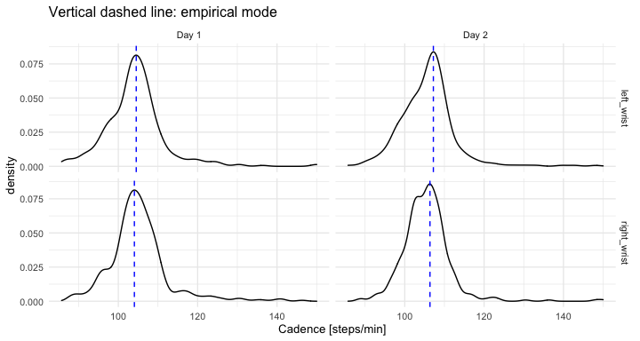

Automatic walking strides segmentation from wrist-worn sensor
accelerometry data collected in the free-living
================

  - [Accelerometry data sample](#accelerometry-data-sample)
      - [Description](#description)
      - [Raw data visualization](#raw-data-visualization)
  - [Segment individual walking
    strides](#segment-individual-walking-strides)
      - [Algorithm](#algorithm)
      - [Stride pattern templates](#stride-pattern-templates)
      - [Segmentation](#segmentation)
      - [Visualization of segmented walking
        strides](#visualization-of-segmented-walking-strides)
  - [Estimation of walking cadence
    (steps/s)](#estimation-of-walking-cadence-stepss)
      - [Daily walking cadence](#daily-walking-cadence)
      - [Hourly walking cadence](#hourly-walking-cadence)
  - [Session info](#session-info)
  - [References](#references)

<!-- README.md is generated from README.Rmd. Please edit that file -->

Below, we demonstrate our method for automatic walking strides
segmentation from wrist-worn sensor accelerometry data collected in the
free-living environment.

This repository accompanies “*Estimation of free-living walking cadence
from wrist-worn sensor accelerometry data and its association with SF-36
quality of life scores*” \[manuscript\]\[1\] in which the method is
proposed. The method is implemented as the `segmentWalking()` function
in `adept` R package ([CRAN
index](https://cran.r-project.org/web/packages/adept/index.html)).
Below, we demonstrate the method with the use of independent data sample
(not used in the manuscript study).

### Accelerometry data sample

#### Description

The directory `data/` contains data files:

  - `acc_raw_left_wrist.rds`
  - `acc_raw_right_wrist.rds`

which are a sample of raw accelerometry data collected consecutively for
2 days, starting and ending at midnight of a week day. Data were
collected at the sampling frequency of 100 Hz with two ActiGraph GT9X
Link sensors located at the left wrist and right wrist, respectively.
One data observation includes `(x,y,z)` values collected from each of
the three axes at the same time. At the sampling frequency of 100 Hz,
there were 100 observations collected per second (17,280,000
observations per 2 days) for each of the two sensors.

Below, we read the data and plot a few first and last observations from
left wrist data set.

``` r
library(tidyverse)
library(lubridate)
library(adeptdata) # for stride pattern templates data 
library(adept)

# read raw accelerometry data from left wrist, right wrist
dat_lw <- readRDS(paste0(here::here(), "/data/acc_raw_left_wrist.rds")) %>% as_tibble()
dat_rw <- readRDS(paste0(here::here(), "/data/acc_raw_right_wrist.rds")) %>% as_tibble()

# define data collection POSIXct (used *fake* day date of Feb 1, 2021)
obs_datetime_seq <- seq(ymd_hms("2021-02-01 00:00:00"), by = 0.01, length.out = nrow(dat_lw))
dat_lw <- mutate(dat_lw, obs_datetime = obs_datetime_seq, .before = "x")
dat_rw <- mutate(dat_rw, obs_datetime = obs_datetime_seq, .before = "x")
```

``` r
rbind(head(dat_lw, 3), tail(dat_lw, 3))
#> # A tibble: 6 x 6
#>   loc_id      obs_idx obs_datetime             x      y      z
#>   <chr>         <int> <dttm>               <dbl>  <dbl>  <dbl>
#> 1 left_wrist        1 2021-02-01 00:00:00  1      0.176  0.016
#> 2 left_wrist        2 2021-02-01 00:00:00  1      0.176  0.016
#> 3 left_wrist        3 2021-02-01 00:00:00  1      0.176  0.016
#> 4 left_wrist 17279998 2021-02-02 23:59:59 -0.977 -0.078 -0.188
#> 5 left_wrist 17279999 2021-02-02 23:59:59 -0.977 -0.078 -0.188
#> 6 left_wrist 17280000 2021-02-02 23:59:59 -0.977 -0.078 -0.188
```

Data were collected from a healthy 28F person.

<details>

<summary>(Click to see IRB note.)</summary>

The raw accelerometry data in `data/` package were collected from
sensors worn by Marta Karas, an author of this repository. The IRB
Office Determination Request Form for Primary (New) Data Collection
request form was submitted in regard to the collection and further
publishing of these data. Based on preliminary review of the request
form submitted, it was determined that the data collection and further
data publishing activity described in the determination request does not
qualify as human subjects research as defined by DHHS regulations 45 CFR
46.102, and does not require IRB oversight.

</details>

#### Raw data visualization

One way to visualize raw accelerometry data is to plot it as a
three-dimensional time-series `(x,y,z)`. Here, we plot data from three
different time frames, each of 4 seconds length, simultaneously for data
collected at left wrist and right wrist.

<details>

<summary>(Click to see the code.)</summary>

``` r
# define time frame start values for data subset
t1 <- ymd_hms("2021-02-01 09:57:11") 
t2 <- ymd_hms("2021-02-01 09:59:41") 
t3 <- ymd_hms("2021-02-01 10:03:47") 

# combine data from two sensors, subset to keep only selected time windows 
dat <- rbind(dat_lw, dat_rw)
dat_sub <- dat %>%
  filter((obs_datetime >= t1 & obs_datetime < t1 + as.period(4, "seconds")) | 
           (obs_datetime >= t2 & obs_datetime < t2 + as.period(4, "seconds")) | 
           (obs_datetime >= t3 & obs_datetime < t3 + as.period(4, "seconds")) ) %>%
  mutate(dt_floor = paste0("time frame start: ", 
                           floor_date(obs_datetime, unit = "minutes")))

# plot (x,y,z) values 
dat_sub %>%
  select(-obs_idx) %>% 
  pivot_longer(cols = -c(dt_floor, obs_datetime, loc_id)) %>%
  ggplot(aes(x = obs_datetime, y = value, color = name)) + 
  geom_line(size = 0.3) + 
  facet_grid(loc_id ~ dt_floor, scales = "free_x") + 
  theme_minimal(base_size = 10) + 
  labs(x = "Time [s]", 
       y = "Acceleration [g]", 
       color = "Accelerometer axis of measurement: ") + 
  theme(legend.position = "top")
```

</details>

<!-- -->

Vector magnitude (VM) is often used to reduce the dimensionality of
accelerometry time-series `(x,y,z)`. VM is computed as `vm = sqrt(x^2 +
y^2 + z^2)` at each time point resulting in 1- instead of 3-dimensional
time-series.

<details>

<summary>(Click to see the code.)</summary>

``` r
# plot vector magnitude values 
dat_sub %>%
  mutate(vm = sqrt(x^2 + y^2 + z^2)) %>%
  ggplot(aes(x = obs_datetime, y = vm)) + 
  geom_line(size = 0.3) + 
  facet_grid(loc_id ~ dt_floor, scales = "free_x") + 
  theme_minimal(base_size = 10) + 
  labs(x = "Time [s]", y = "VM") 
```

</details>

<!-- -->

### Segment individual walking strides

#### Algorithm

We use `segmentWalking()` function in `adept` R package to automatically
segment individual walking strides from the raw accelerometry data
collected with a wrist-worn sensor.

First, the function first uses Adaptive Empirical Pattern Transformation
(ADEPT) method (see \[ADEPT manuscript\]\[2\]) to segment walking stride
patterns. In short, ADEPT uses a predefined template and detects its
repetitions in data by maximizing the local correlation between
scale-transformed template’s versions and the observed data at every
time point. Multiple baseline templates can be used simultaneously to
best fit various shapes of strides. The ADEPT result describes each
segmented stride by its:

  - 1)  start time,

  - 2)  duration (seconds),  

  - 3)  correlation with best-fit template.

Second, the function filters the patterns segmented from the data to
keep those which plausibly and with high specificity correspond to
walking activity. Methodological details are reported in the method
\[manuscript\]\[1\].

#### Stride pattern templates

Below, we use three wrist-specific stride templates publicly available
in
[adeptdata](https://cran.r-project.org/web/packages/adeptdata/index.html)
R package.

``` r
# pull 3 x 200 matrix with 3 distinct stride pattern templates
# (attached in adeptdata R package)
templates_mat <- stride_template$left_wrist[[3]]
```

<details>

<summary>(Click to see the code.)</summary>

``` r
plt_df <- 
  templates_mat %>% 
  as.data.frame() %>%
  rename_all(~as.character(seq(0, 1, length.out = ncol(templates_mat)))) %>%
  mutate(template_idx = row_number()) %>%
  pivot_longer(cols = -template_idx) %>%
  mutate(name = as.numeric(name),
         template_idx = factor(template_idx, labels = paste0("Template ", 1 : 3)))

ggplot(plt_df, aes(x = name, y = value)) + 
  geom_line() + 
  facet_wrap(~ template_idx) +
  theme_minimal(base_size = 10) +
  labs(x = "Templaste phase", y = "VM") + 
  labs(x = "Time [s]", y = "VM") 
```

</details>

<!-- -->

#### Segmentation

We use `segmentWalking()` method from `adept` R package to segment
walking separately from data from (a) left wrist, (b) right-wrist worn
sensor. Default algorithm parameters are optimized for a wrist-worn
sensor.

<details>

<summary>(Click to see the code – part 1.)</summary>

``` r
# convert templates matrix to templates list 
templates_list <-  list(templates_mat[1, ], templates_mat[2, ], templates_mat[3, ])

# segment walking from data collected with a left wrist-worn sensor
t1 <- Sys.time()
out_lw <- segmentWalking(
  xyz = dat_lw %>% select(all_of(c("x", "y", "z"))),
  xyz.fs = 100,
  template = templates_list,
  run.parallel = TRUE,
  run.parallel.cores = 8)
Sys.time() - t1
# Time difference of 10.45637 mins

# segment walking from data collected with a right wrist-worn sensor
t1 <- Sys.time()
out_rw <- segmentWalking(
  xyz = dat_rw %>% select(all_of(c("x", "y", "z"))),
  xyz.fs = 100,
  template = templates_list,
  run.parallel = TRUE,
  run.parallel.cores = 8)
Sys.time() - t1
# Time difference of 5.958216 mins

# save precomputed results for faster README compilation 
saveRDS(out_lw, paste0(here::here(), "/data/out_lw.rds"))
saveRDS(out_rw, paste0(here::here(), "/data/out_rw.rds"))
```

</details>

<details>

<summary>(Click to see the code – part 2.)</summary>

``` r
# read precomputed results for faster README compilation 
out_lw <- readRDS(paste0(here::here(), "/data/out_lw.rds"))
out_rw <- readRDS(paste0(here::here(), "/data/out_rw.rds")) 

# filter output to keep rows corresponding to identified walking
out_lw_1 <- out_lw %>% filter(is_walking_i == 1)
out_rw_1 <- out_rw %>% filter(is_walking_i == 1)

head(out_lw_1)
#>     tau_i T_i     sim_i template_i is_walking_i
#> 1 3595614 112 0.8986153         NA            1
#> 2 3595725 111 0.9564651         NA            1
#> 3 3595835 122 0.9417612         NA            1
#> 4 3598471 113 0.9049312         NA            1
#> 5 3598583 110 0.9398946         NA            1
#> 6 3598692 131 0.8926561         NA            1
```

</details>

#### Visualization of segmented walking strides

Below, we visualize first K=50 strides segmented from (a) left wrist,
(b) right-wrist worn sensor.

<details>

<summary>(Click to see the code.)</summary>

``` r
# get VM from raw data frames
dat_lw_vm <- sqrt(dat_lw$x^2 + dat_lw$y^2 + dat_lw$z^2)
dat_rw_vm <- sqrt(dat_rw$x^2 + dat_rw$y^2 + dat_rw$z^2)

K <- 50
T_i_max <- max(c(out_lw_1$T_i, out_rw_1$T_i))
stride_dat <- numeric()
stride_id  <- numeric()
stride_loc <- numeric()
for (k in 1 : K){ # k <- 1
  # left wrist data 
  dat_idx_k  <- (out_lw_1[k, "tau_i"]) : (out_lw_1[k, "tau_i"] + out_lw_1[k, "T_i"] - 1)
  dat_k      <- dat_lw_vm[dat_idx_k]
  stride_dat <- c(stride_dat, dat_k)
  stride_id  <- c(stride_id, rep(k, length(dat_k)))
  stride_loc <- c(stride_loc, rep("left_wrist", length(dat_k)))
  # right wrist data 
  dat_idx_k  <- (out_rw_1[k, "tau_i"]) : (out_rw_1[k, "tau_i"] + out_rw_1[k, "T_i"] - 1)
  dat_k      <- dat_rw_vm[dat_idx_k]
  stride_dat <- c(stride_dat, dat_k)
  stride_id  <- c(stride_id, rep(k, length(dat_k)))
  stride_loc <- c(stride_loc, rep("right_wrist", length(dat_k)))
}

# define plot data frame
plt_df <- 
  data.frame(stride_dat, stride_id, stride_loc) %>%
  group_by(stride_id, stride_loc) %>%
  mutate(stride_duration = row_number() - 1,
         stride_duration = stride_duration / 100) %>%
  ungroup()
# point-wise aggregate of strides
plt_df_agg <- 
  plt_df %>% 
  group_by(stride_loc, stride_duration) %>% 
  summarise(stride_dat = mean(stride_dat))  %>%
  ungroup()

ggplot(plt_df, aes(x = stride_duration, y = stride_dat, group = stride_id)) + 
  geom_line(alpha = 0.2) +
  facet_wrap(~ stride_loc) +
  theme_minimal(base_size = 10) +
  labs(x = "Stride duration [s]", y = "VM") 
```

</details>

<!-- -->

### Estimation of walking cadence (steps/s)

#### Daily walking cadence

The data used in this tutorial consists of two days of continuous
monitoring. We use

segmented strides to estimate the walking cadence (number of steps per
second) at every time of the day when walking was identified. Next, we
compute the mode of all estimated cadences during the day was computed –
a *daily cadence* measurement.

<details>

<summary>(Click to see the code.)</summary>

``` r
# function to compute mode
estimate_mode <- function(x) {
  d <- density(x)
  d$x[which.max(d$y)]
}

# data collection frequency
hz_val <- 100

# combine result from walking segmentation from left and right wrist  
out_comb_1 <- rbind(
  out_lw_1 %>% mutate(loc_id = "left_wrist"),
  out_rw_1 %>% mutate(loc_id = "right_wrist")
) %>% 
  mutate(
    # define stride duration (in seconds) as number of observations in stride 
    # (stride := two subsequent steps)
    # over data frequency (number of observations per 1 second)
    dur_i = T_i / hz_val, 
    # define cadence as number of steps per 1 second
    cadence_i = 2/dur_i,
    # define collection day "ID" 
    day_id = ceiling(tau_i / (hz_val * 60 * 60 * 24)),
    day_id = factor(day_id, levels = c(1,2), labels = paste0("Day ", 1:2))
  ) 

# aggregate the cadence measurements by computing empirical mode
# (1 value per day)
out_comb_1_mode <- 
  out_comb_1 %>%
  group_by(loc_id, day_id) %>%
  summarise(dur_i_mode = estimate_mode(dur_i),
            cadence_i_mode = estimate_mode(cadence_i)) %>%
  arrange(day_id, loc_id) %>%
  as.data.frame()

ggplot(out_comb_1, aes(x = cadence_i)) + 
  geom_density() + 
  facet_grid(loc_id ~ day_id) + 
  geom_vline(data = out_comb_1_mode, aes(xintercept = cadence_i_mode), 
             linetype = 2, color = "blue") +
  theme_minimal(base_size = 10) + 
  labs(x = "Cadence [steps/s]", title = "Vertical dashed line: empirical mode")
```

</details>

<!-- -->

The table summarizes empirical mode of stride duration \[s\] and cadence
\[steps/s\]:

<details>

<summary>(Click to see the code.)</summary>

``` r
print(out_comb_1_mode)
#>        loc_id day_id dur_i_mode cadence_i_mode
#> 1  left_wrist  Day 1   1.147018       1.741989
#> 2 right_wrist  Day 1   1.150091       1.734214
#> 3  left_wrist  Day 2   1.117782       1.786894
#> 4 right_wrist  Day 2   1.128068       1.772624
```

</details>

    #>        loc_id day_id dur_i_mode cadence_i_mode
    #> 1  left_wrist  Day 1   1.147018       1.741989
    #> 2 right_wrist  Day 1   1.150091       1.734214
    #> 3  left_wrist  Day 2   1.117782       1.786894
    #> 4 right_wrist  Day 2   1.128068       1.772624

#### Hourly walking cadence

Similarly, next, we compute the mode of all estimated cadences during
the day-hour was computed. We visualize hourly cadence estimated for
day-hours where the number of estimated walking strides is more or equal
10.

<details>

<summary>(Click to see the code.)</summary>

``` r
# compute hour ID  
out_comb_1 <- 
  out_comb_1 %>%
  mutate(
    hour_id = floor(tau_i / (hz_val * 60 * 60)),
    hour_id = hour_id %% 24
  )

# aggregate the cadence measurements by computing empirical mode
# (1 value per day-hour)
out_comb_1_mode_hourly <- 
  out_comb_1 %>%
  group_by(loc_id, day_id, hour_id) %>%
  summarise(cadence_i_mode = estimate_mode(cadence_i),
            cnt = n()) %>%
  as.data.frame()

ggplot(out_comb_1_mode_hourly %>% filter(cnt > 10), 
       aes(x = hour_id, y = cadence_i_mode, group = 1)) + 
  geom_line(linetype = 2, size = 0.5, color = "grey") + 
  geom_point(aes(size = cnt, alpha = cnt)) + 
  facet_grid(loc_id ~ day_id) + 
  theme_minimal(base_size = 10) + 
  labs(x = "Hour of a day", 
       y = "Cadence [steps/s]",
       alpha = "Segmented\nstrides\ncount",
       size = "Segmented\nstrides\ncount") + 
  scale_x_continuous(limits = c(0, 23), breaks = seq(0, 23, by = 2))
```

</details>

<!-- -->

### Session info

<details>

<summary>(Click to see session info.)</summary>

``` r
devtools::session_info()
#> ─ Session info ───────────────────────────────────────────────────────────────
#>  setting  value                       
#>  version  R version 4.0.3 (2020-10-10)
#>  os       macOS Catalina 10.15.7      
#>  system   x86_64, darwin17.0          
#>  ui       X11                         
#>  language (EN)                        
#>  collate  en_US.UTF-8                 
#>  ctype    en_US.UTF-8                 
#>  tz       America/New_York            
#>  date     2021-03-07                  
#> 
#> ─ Packages ───────────────────────────────────────────────────────────────────
#>  package     * version  date       lib source        
#>  adept       * 1.2      2021-01-31 [1] local         
#>  adeptdata   * 1.0.1    2019-03-30 [1] CRAN (R 4.0.2)
#>  assertthat    0.2.1    2019-03-21 [1] CRAN (R 4.0.2)
#>  backports     1.2.1    2020-12-09 [1] CRAN (R 4.0.2)
#>  broom         0.7.5    2021-02-19 [1] CRAN (R 4.0.3)
#>  cachem        1.0.4    2021-02-13 [1] CRAN (R 4.0.2)
#>  callr         3.5.1    2020-10-13 [1] CRAN (R 4.0.2)
#>  cellranger    1.1.0    2016-07-27 [1] CRAN (R 4.0.2)
#>  cli           2.3.0    2021-01-31 [1] CRAN (R 4.0.3)
#>  codetools     0.2-18   2020-11-04 [1] CRAN (R 4.0.2)
#>  colorspace    2.0-0    2020-11-11 [1] CRAN (R 4.0.2)
#>  crayon        1.4.1    2021-02-08 [1] CRAN (R 4.0.2)
#>  data.table    1.14.0   2021-02-21 [1] CRAN (R 4.0.3)
#>  DBI           1.1.1    2021-01-15 [1] CRAN (R 4.0.2)
#>  dbplyr        2.1.0    2021-02-03 [1] CRAN (R 4.0.2)
#>  desc          1.2.0    2018-05-01 [1] CRAN (R 4.0.2)
#>  devtools      2.3.2    2020-09-18 [1] CRAN (R 4.0.2)
#>  digest        0.6.27   2020-10-24 [1] CRAN (R 4.0.2)
#>  dplyr       * 1.0.4    2021-02-02 [1] CRAN (R 4.0.2)
#>  dvmisc        1.1.4    2019-12-16 [1] CRAN (R 4.0.2)
#>  ellipsis      0.3.1    2020-05-15 [1] CRAN (R 4.0.2)
#>  evaluate      0.14     2019-05-28 [1] CRAN (R 4.0.1)
#>  fansi         0.4.2    2021-01-15 [1] CRAN (R 4.0.2)
#>  fastmap       1.1.0    2021-01-25 [1] CRAN (R 4.0.2)
#>  forcats     * 0.5.1    2021-01-27 [1] CRAN (R 4.0.2)
#>  fs            1.5.0    2020-07-31 [1] CRAN (R 4.0.2)
#>  generics      0.1.0    2020-10-31 [1] CRAN (R 4.0.2)
#>  ggplot2     * 3.3.3    2020-12-30 [1] CRAN (R 4.0.2)
#>  glue          1.4.2    2020-08-27 [1] CRAN (R 4.0.2)
#>  gtable        0.3.0    2019-03-25 [1] CRAN (R 4.0.2)
#>  haven         2.3.1    2020-06-01 [1] CRAN (R 4.0.2)
#>  here          1.0.1    2020-12-13 [1] CRAN (R 4.0.2)
#>  hms           1.0.0    2021-01-13 [1] CRAN (R 4.0.2)
#>  htmltools     0.5.1.1  2021-01-22 [1] CRAN (R 4.0.2)
#>  httr          1.4.2    2020-07-20 [1] CRAN (R 4.0.2)
#>  jsonlite      1.7.2    2020-12-09 [1] CRAN (R 4.0.2)
#>  knitr         1.31     2021-01-27 [1] CRAN (R 4.0.2)
#>  lattice       0.20-41  2020-04-02 [1] CRAN (R 4.0.3)
#>  lifecycle     1.0.0    2021-02-15 [1] CRAN (R 4.0.2)
#>  lubridate   * 1.7.9.2  2020-11-13 [1] CRAN (R 4.0.2)
#>  magrittr      2.0.1    2020-11-17 [1] CRAN (R 4.0.2)
#>  MASS          7.3-53.1 2021-02-12 [1] CRAN (R 4.0.2)
#>  Matrix        1.3-2    2021-01-06 [1] CRAN (R 4.0.2)
#>  memoise       2.0.0    2021-01-26 [1] CRAN (R 4.0.2)
#>  mitools       2.4      2019-04-26 [1] CRAN (R 4.0.2)
#>  modelr        0.1.8    2020-05-19 [1] CRAN (R 4.0.2)
#>  munsell       0.5.0    2018-06-12 [1] CRAN (R 4.0.2)
#>  mvtnorm       1.1-1    2020-06-09 [1] CRAN (R 4.0.2)
#>  pillar        1.5.0    2021-02-22 [1] CRAN (R 4.0.3)
#>  pkgbuild      1.2.0    2020-12-15 [1] CRAN (R 4.0.2)
#>  pkgconfig     2.0.3    2019-09-22 [1] CRAN (R 4.0.2)
#>  pkgload       1.1.0    2020-05-29 [1] CRAN (R 4.0.2)
#>  pracma        2.3.3    2021-01-23 [1] CRAN (R 4.0.2)
#>  prettyunits   1.1.1    2020-01-24 [1] CRAN (R 4.0.2)
#>  processx      3.4.5    2020-11-30 [1] CRAN (R 4.0.2)
#>  ps            1.5.0    2020-12-05 [1] CRAN (R 4.0.2)
#>  purrr       * 0.3.4    2020-04-17 [1] CRAN (R 4.0.2)
#>  R6            2.5.0    2020-10-28 [1] CRAN (R 4.0.2)
#>  rbenchmark    1.0.0    2012-08-30 [1] CRAN (R 4.0.2)
#>  Rcpp          1.0.6    2021-01-15 [1] CRAN (R 4.0.2)
#>  readr       * 1.4.0    2020-10-05 [1] CRAN (R 4.0.2)
#>  readxl        1.3.1    2019-03-13 [1] CRAN (R 4.0.2)
#>  remotes       2.2.0    2020-07-21 [1] CRAN (R 4.0.2)
#>  reprex        1.0.0    2021-01-27 [1] CRAN (R 4.0.2)
#>  rlang         0.4.10   2020-12-30 [1] CRAN (R 4.0.2)
#>  rmarkdown     2.7      2021-02-19 [1] CRAN (R 4.0.3)
#>  rprojroot     2.0.2    2020-11-15 [1] CRAN (R 4.0.2)
#>  rstudioapi    0.13     2020-11-12 [1] CRAN (R 4.0.2)
#>  rvest         0.3.6    2020-07-25 [1] CRAN (R 4.0.2)
#>  scales        1.1.1    2020-05-11 [1] CRAN (R 4.0.2)
#>  sessioninfo   1.1.1    2018-11-05 [1] CRAN (R 4.0.2)
#>  stringi       1.5.3    2020-09-09 [1] CRAN (R 4.0.2)
#>  stringr     * 1.4.0    2019-02-10 [1] CRAN (R 4.0.2)
#>  survey        4.0      2020-04-03 [1] CRAN (R 4.0.2)
#>  survival      3.2-7    2020-09-28 [1] CRAN (R 4.0.3)
#>  tab           4.1.1    2019-06-17 [1] CRAN (R 4.0.2)
#>  testthat      3.0.2    2021-02-14 [1] CRAN (R 4.0.2)
#>  tibble      * 3.0.6    2021-01-29 [1] CRAN (R 4.0.2)
#>  tidyr       * 1.1.2    2020-08-27 [1] CRAN (R 4.0.2)
#>  tidyselect    1.1.0    2020-05-11 [1] CRAN (R 4.0.2)
#>  tidyverse   * 1.3.0    2019-11-21 [1] CRAN (R 4.0.2)
#>  usethis       2.0.1    2021-02-10 [1] CRAN (R 4.0.2)
#>  utf8          1.1.4    2018-05-24 [1] CRAN (R 4.0.2)
#>  vctrs         0.3.6    2020-12-17 [1] CRAN (R 4.0.2)
#>  withr         2.4.1    2021-01-26 [1] CRAN (R 4.0.2)
#>  xfun          0.21     2021-02-10 [1] CRAN (R 4.0.2)
#>  xml2          1.3.2    2020-04-23 [1] CRAN (R 4.0.2)
#>  xtable        1.8-4    2019-04-21 [1] CRAN (R 4.0.2)
#>  yaml          2.2.1    2020-02-01 [1] CRAN (R 4.0.2)
#> 
#> [1] /Library/Frameworks/R.framework/Versions/4.0/Resources/library
```

</details>

### References

\[1\]: Karas, M., Urbanek, J.K., Illiano, V.P., Bogaarts, G.,
Crainiceanu, C.M., Dorn, J.F. (2021). *Estimation of free-living walking
cadence from wrist-worn sensor accelerometry data and its association
with SF-36 quality of life scores*, Submitted.

\[2\]: Karas, M., Straczkiewicz, M., Fadel, W., Harezlak, J.,
Crainiceanu, C.M., Urbanek, J.K. (2018). Adaptive empirical pattern
transformation (ADEPT) with application to walking stride segmentation,
Biostatistics, kxz033.
